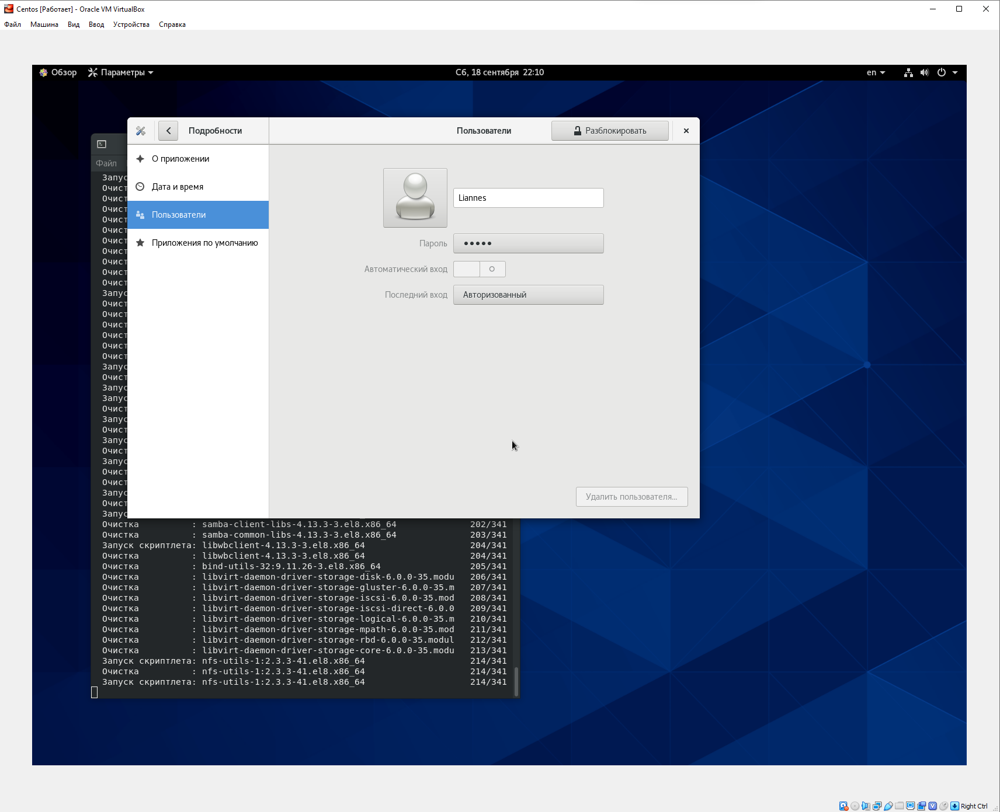

---
## Front matter
lang: ru-RU
title: Отчет по лабораторной работе №1
author: Панкратьев Александр Владимирович
institute: RUDN University, Moscow, Russian Federation
date: 2021

## Formatting
mainfont: Times New Roman
romanfont: Times New Roman
sansfont: Times New Roman
monofont: Times New Roman
toc: false
slide_level: 2
theme: metropolis
header-includes:
 - \metroset{progressbar=frametitle,sectionpage=progressbar,numbering=fraction}
 - '\makeatletter'
 - '\beamer@ignorenonframefalse'
 - '\makeatother'
aspectratio: 43
section-titles: true
---

## Цели работы

1. Приобрести практические навыки установки операционной системы на виртуальную машину. 
2. Настроить необходимые для дальнейшей работы сервисы

## Задачи работы

1. Скачать образ виртуальной машины CentOS.
2. Создать виртуальную машину Base из скачанного образа.
3. Установить и настроить операционную систему.

## Выполнение. Создание виртуальной машины

Создал виртуальную машину Centos, задал необходимые натройки. Тип - Linux, RedHat.
Тип жесткого диска - VDI. Формат хранения - динамический. Размер диска - 80 ГБ. 

## Создание виртуальной машины

Добавил новый привод оптических дисков и выбрала образ CentOS-8.4.2105-x86_64-dvd1.iso.

{#fig:001 width=70%}

## Настройка операционной системы

Запустил виртуальную машину и выполнила необходимые настройки: Установил язык интерфейса; задал имя машины;
указал часовой пояс; установил пароль для root; создал пользователя. Перезапустил виртуальную машину и подключилась под своим пользователем.

## Настройка операционной системы

{#fig:002 width=70%}

## Выводы

Я приобрел практические навыки установки операционной системы CentOS на виртуальную машину и настроил необходимые для дальшейшей работы сервисы.

