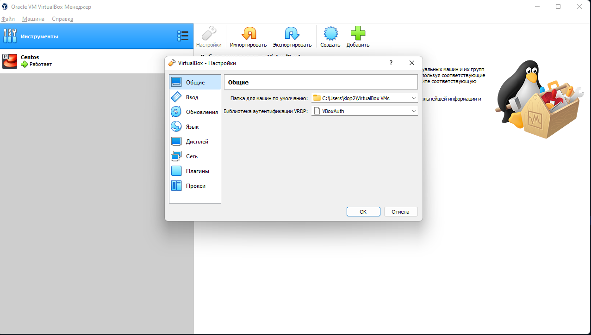
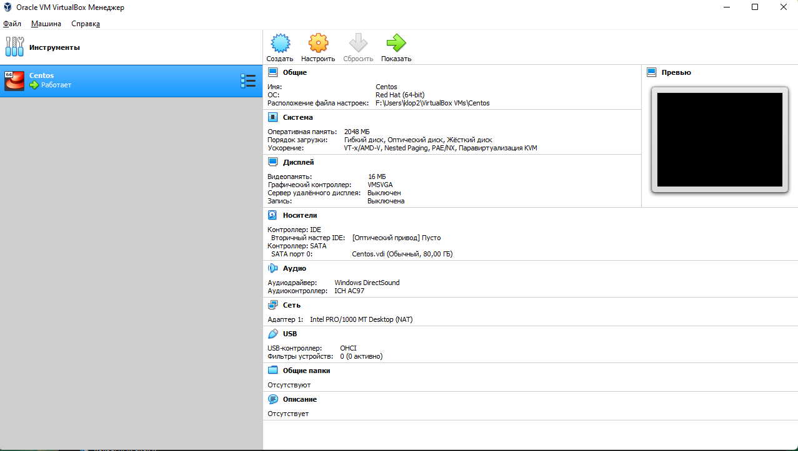
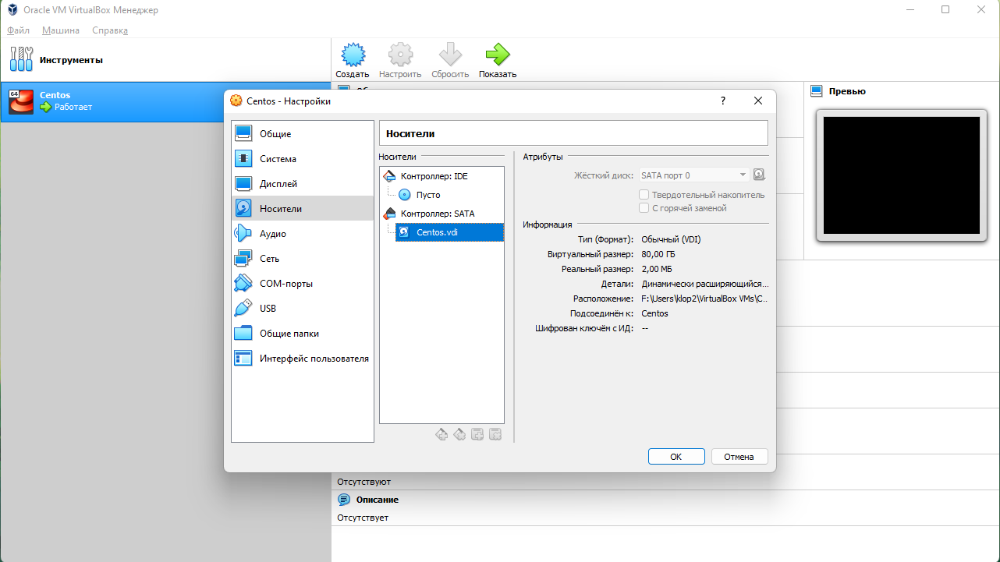
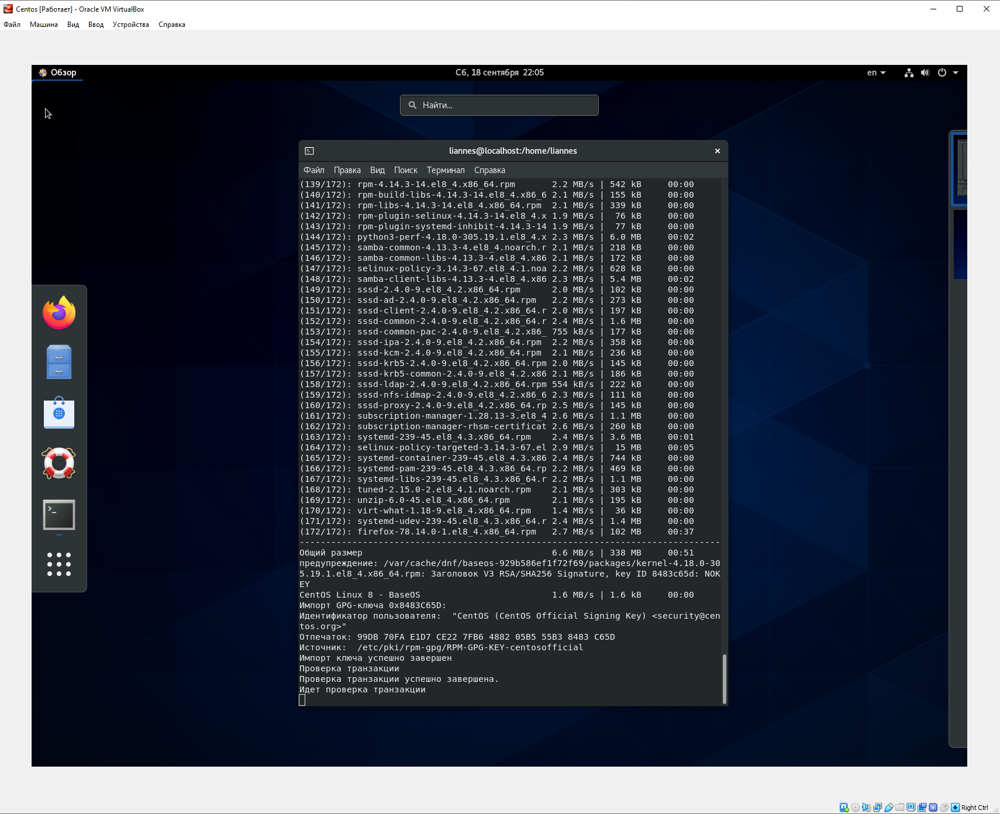
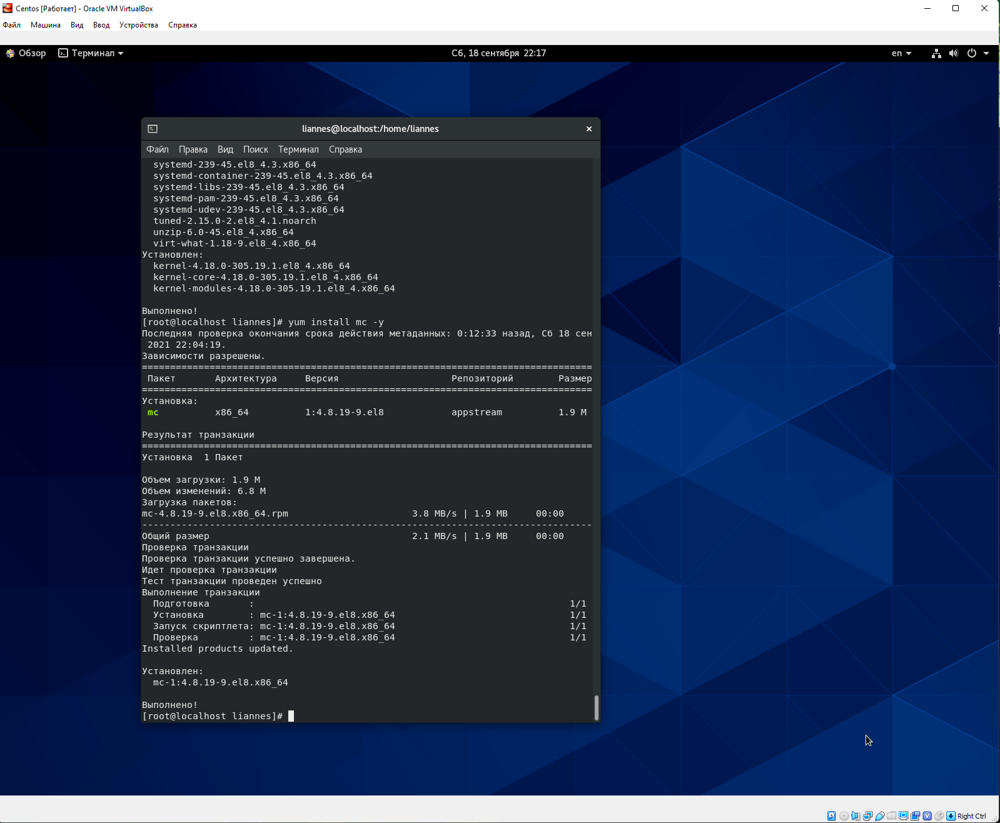

---
# Front matter
lang: ru-RU
title: "Отчёт по лабораторной работе"
subtitle: "Лабораторная №1"
author: "Панкратьев Александр Владимирович"

# Formatting
toc-title: "Содержание"
toc: true # Table of contents
toc_depth: 2
lof: true # List of figures
lot: true # List of tables
fontsize: 12pt
linestretch: 1.5
papersize: a4paper
documentclass: scrreprt
polyglossia-lang: russian
polyglossia-otherlangs: english
mainfont: Times New Roman
romanfont: Times New Roman
sansfont: Times New Roman
monofont: Times New Roman
mainfontoptions: Ligatures=TeX
romanfontoptions: Ligatures=TeX
sansfontoptions: Ligatures=TeX,Scale=MatchLowercase
monofontoptions: Scale=MatchLowercase
indent: true
pdf-engine: lualatex
header-includes:
  - \linepenalty=10 # the penalty added to the badness of each line within a paragraph (no associated penalty node) Increasing the value makes tex try to have fewer lines in the paragraph.
  - \interlinepenalty=0 # value of the penalty (node) added after each line of a paragraph.
  - \hyphenpenalty=50 # the penalty for line breaking at an automatically inserted hyphen
  - \exhyphenpenalty=50 # the penalty for line breaking at an explicit hyphen
  - \binoppenalty=700 # the penalty for breaking a line at a binary operator
  - \relpenalty=500 # the penalty for breaking a line at a relation
  - \clubpenalty=150 # extra penalty for breaking after first line of a paragraph
  - \widowpenalty=150 # extra penalty for breaking before last line of a paragraph
  - \displaywidowpenalty=50 # extra penalty for breaking before last line before a display math
  - \brokenpenalty=100 # extra penalty for page breaking after a hyphenated line
  - \predisplaypenalty=10000 # penalty for breaking before a display
  - \postdisplaypenalty=0 # penalty for breaking after a display
  - \floatingpenalty = 20000 # penalty for splitting an insertion (can only be split footnote in standard LaTeX)
  - \raggedbottom # or \flushbottom
  - \usepackage{float} # keep figures where there are in the text
  - \floatplacement{figure}{H} # keep figures where there are in the text
---

# Цель работы

Приобрести практические навыки установки операционной системы на виртуальную машину, настроить необходимые для дальнейшей работы сервисы

# Задачи работы

1. Скачать образ виртуальной машины CentOS.
2. Создать виртуальную машину Base из скачанного образа.
3. Установить и настроить операционную систему.

# Выполнение лабораторной работы

Скачал образ CentOS-8.4.2105-x86_64-dvd1.
Запустил виртуальную машину VirtualBox. Проверил в свойствах VirtualBox месторасположение каталога для 
виртуальных машин (рис. -@fig:001).

{#fig:001 width=70%}

Создал новую виртуальную машину и установил CentOS, а также настроил (рис. -@fig:002) (рис. -@fig:003)

{#fig:002 width=70%}

{#fig:003 width=70%}

Выделил 80 гб для оперционной системы, также назвал машшину "Centos"
Выполнил установку системы, настроил пояса, также пользоватля

Во время снятия видео-отчета, у меня была ошибка, что не обновлялся yum
Проблема заключалось в том, что у меня оказывается был выключен интернет

С помощью команды yum update обновил системные файлы и установил Midnight Commander (рис. -@fig:004, -@fig:005).

{#fig:004 width=70%} 

{#fig:005 width=70%} 

После установки необходимых программ завершил работу виртуальной машины. 

# Вывод

Я приобрел практические навыки установки операционной системы CentOS на виртуальную машину, настроила необходимые для дальшейшей работы сервисы.