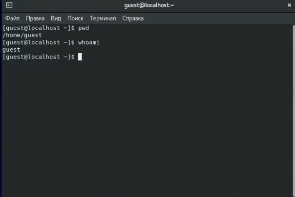
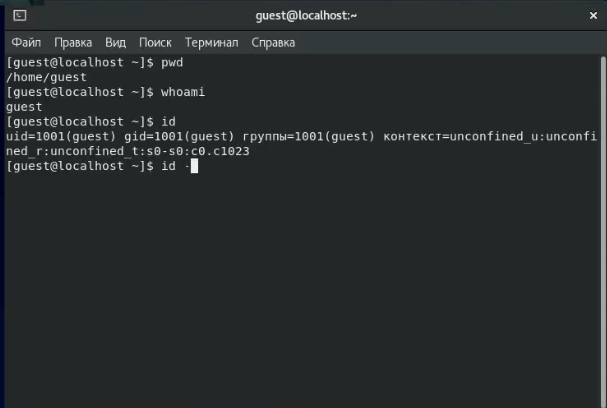
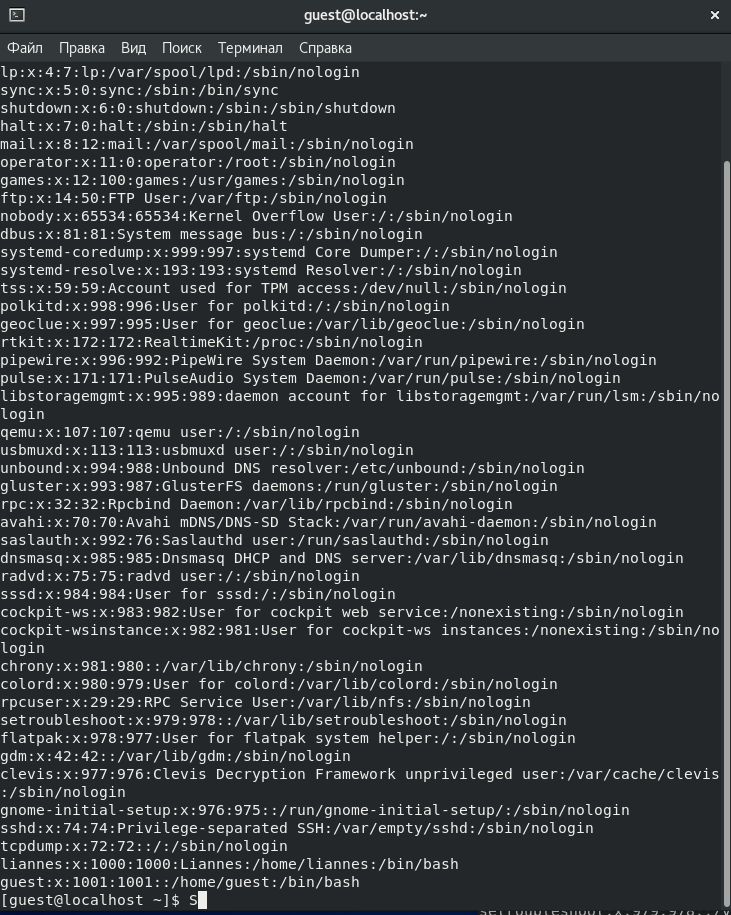
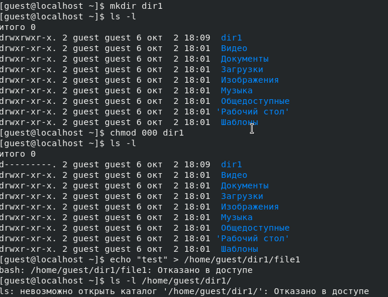

---
## Front matter
lang: ru-RU
title: Отчет по лабораторной работе №1
author: Панкратьев Александр Владимирович
institute: RUDN University, Moscow, Russian Federation
date: 2021

## Formatting
mainfont: Times New Roman
romanfont: Times New Roman
sansfont: Times New Roman
monofont: Times New Roman
toc: false
slide_level: 2
theme: metropolis
header-includes:
 - \metroset{progressbar=frametitle,sectionpage=progressbar,numbering=fraction}
 - '\makeatletter'
 - '\beamer@ignorenonframefalse'
 - '\makeatother'
aspectratio: 43
section-titles: true
---

## Цели работы

Приобрести практические навыки в Centos OS

## Задачи работы

1. Создать новую учетную запись и к ней пароль
2. Узнать uid и gid пользователя
3. Понять как работают атребуты директории и права доступ

## Создание нового пользователя

{#fig:001 width=70%}

## Вывод данных с помощью команд

{#fig:002 width=70%}

## Вывод данных с помощью команд

{#fig:003 width=70%}

## Вывод данных с помощью команд

{#fig:004 width=70%}

## Вывод данных с помощью команд

{#fig:005 width=70%}

## Права доступа

{#fig:006 width=70%}

## Права доступа

{#fig:007 width=70%}

## Выводы

Я приобрел практические навыки операционной системы CentOS, научился создовать нового пользователя, а также начился назначать права доступа и просмтатривать их

