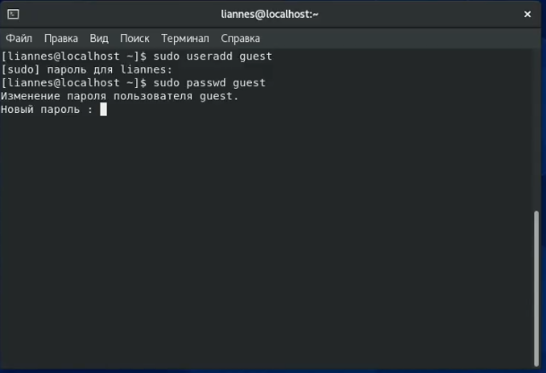
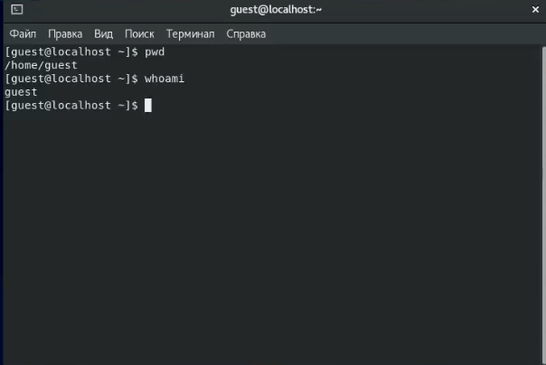
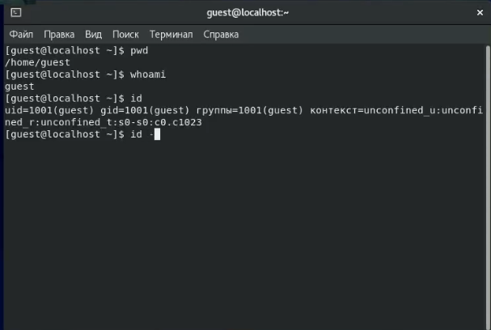
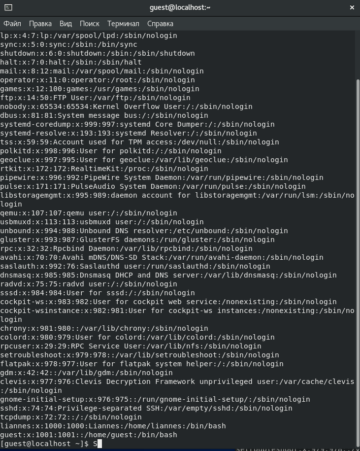
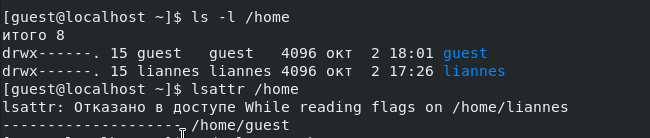
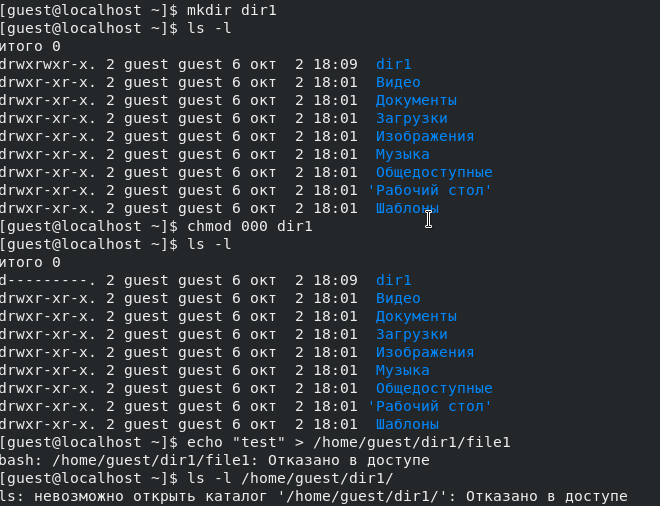
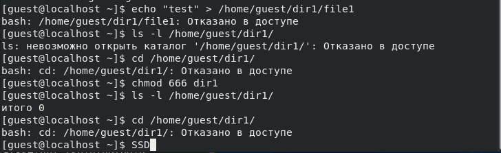

---
# Front matter
lang: ru-RU
title: "Отчёт по лабораторной работе"
subtitle: "Лабораторная №2"
author: "Панкратьев Александр Владимирович"

# Formatting
toc-title: "Содержание"
toc: true # Table of contents
toc_depth: 2
lof: true # List of figures
lot: true # List of tables
fontsize: 12pt
linestretch: 1.5
papersize: a4paper
documentclass: scrreprt
polyglossia-lang: russian
polyglossia-otherlangs: english
mainfont: Times New Roman
romanfont: Times New Roman
sansfont: Times New Roman
monofont: Times New Roman
mainfontoptions: Ligatures=TeX
romanfontoptions: Ligatures=TeX
sansfontoptions: Ligatures=TeX,Scale=MatchLowercase
monofontoptions: Scale=MatchLowercase
indent: true
pdf-engine: lualatex
header-includes:
  - \linepenalty=10 # the penalty added to the badness of each line within a paragraph (no associated penalty node) Increasing the value makes tex try to have fewer lines in the paragraph.
  - \interlinepenalty=0 # value of the penalty (node) added after each line of a paragraph.
  - \hyphenpenalty=50 # the penalty for line breaking at an automatically inserted hyphen
  - \exhyphenpenalty=50 # the penalty for line breaking at an explicit hyphen
  - \binoppenalty=700 # the penalty for breaking a line at a binary operator
  - \relpenalty=500 # the penalty for breaking a line at a relation
  - \clubpenalty=150 # extra penalty for breaking after first line of a paragraph
  - \widowpenalty=150 # extra penalty for breaking before last line of a paragraph
  - \displaywidowpenalty=50 # extra penalty for breaking before last line before a display math
  - \brokenpenalty=100 # extra penalty for page breaking after a hyphenated line
  - \predisplaypenalty=10000 # penalty for breaking before a display
  - \postdisplaypenalty=0 # penalty for breaking after a display
  - \floatingpenalty = 20000 # penalty for splitting an insertion (can only be split footnote in standard LaTeX)
  - \raggedbottom # or \flushbottom
  - \usepackage{float} # keep figures where there are in the text
  - \floatplacement{figure}{H} # keep figures where there are in the text
---

# Цель работы

Приобрести практические навыки в Centos OS

# Задачи работы

1. Создать новую учетную запись и к ней пароль
2. Узнать uid и gid пользователя
3. Понять как работают атребуты директории и права доступа

# Выполнение лабораторной работы

Запустил Centos OS 
Зашел от пользователя с рут и создал нового пользователя (рис. -@fig:001).

{#fig:001 width=70%}

Зашел под новым пользователям guest и с помощью команды pwd, whoaim, id вывел на экран консоли данные (рис. -@fig:002)

{#fig:002 width=70%}

Группа нового пользователя gid = 1001, uid = 1001, группа = 1001 (рис. -@fig:003)

{#fig:003 width=70%}

Следом посмотрел файл passwd 
В последний строчке данные пользователя с его uid и группой (рис. -@fig:004)

{#fig:004 width=70%}

С помощью ls вывел на консоль информацию и права доступа к папке (рис. -@fig:005)

{#fig:005 width=70%}

Cледующим пунктом создаю папку dir1 и присваиваю им новые права через команду chmod 000
В итоге я не могу зайти в папку или создать в ней файл (рис. -@fig:006) (рис. -@fig:007)

{#fig:006 width=70%}
{#fig:007 width=70%}

# Вывод
Я приобрел практические навыки операционной системы CentOS, научился создовать нового пользователя, а также начился назначать права доступа и просмтатривать их