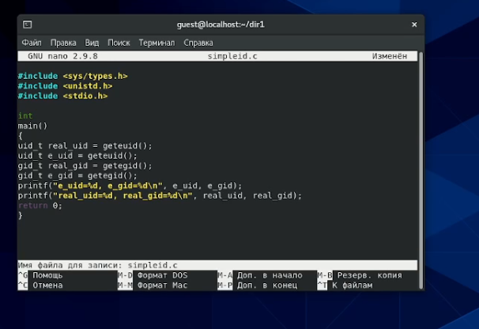

---
# Front matter
lang: ru-RU
title: "Отчёт по лабораторной работе"
subtitle: "Лабораторная №5"
author: "Панкратьев Александр Владимирович"

# Formatting
toc-title: "Содержание"
toc: true # Table of contents
toc_depth: 2
lof: true # List of figures
lot: true # List of tables
fontsize: 12pt
linestretch: 1.5
papersize: a4paper
documentclass: scrreprt
polyglossia-lang: russian
polyglossia-otherlangs: english
mainfont: Times New Roman
romanfont: Times New Roman
sansfont: Times New Roman
monofont: Times New Roman
mainfontoptions: Ligatures=TeX
romanfontoptions: Ligatures=TeX
sansfontoptions: Ligatures=TeX,Scale=MatchLowercase
monofontoptions: Scale=MatchLowercase
indent: true
pdf-engine: lualatex
header-includes:
  - \linepenalty=10 # the penalty added to the badness of each line within a paragraph (no associated penalty node) Increasing the value makes tex try to have fewer lines in the paragraph.
  - \interlinepenalty=0 # value of the penalty (node) added after each line of a paragraph.
  - \hyphenpenalty=50 # the penalty for line breaking at an automatically inserted hyphen
  - \exhyphenpenalty=50 # the penalty for line breaking at an explicit hyphen
  - \binoppenalty=700 # the penalty for breaking a line at a binary operator
  - \relpenalty=500 # the penalty for breaking a line at a relation
  - \clubpenalty=150 # extra penalty for breaking after first line of a paragraph
  - \widowpenalty=150 # extra penalty for breaking before last line of a paragraph
  - \displaywidowpenalty=50 # extra penalty for breaking before last line before a display math
  - \brokenpenalty=100 # extra penalty for page breaking after a hyphenated line
  - \predisplaypenalty=10000 # penalty for breaking before a display
  - \postdisplaypenalty=0 # penalty for breaking after a display
  - \floatingpenalty = 20000 # penalty for splitting an insertion (can only be split footnote in standard LaTeX)
  - \raggedbottom # or \flushbottom
  - \usepackage{float} # keep figures where there are in the text
  - \floatplacement{figure}{H} # keep figures where there are in the text
---

# Цель работы

Изучить механизмы изменения идентификаторов, применения
SetUID- и Sticky-биты. 
Получить практические навыки работы в консоли с дополнительными атрибутами. 
Рассмотреть работы механизма
смены идентификатора процессов пользователей, а также влияние бита
Sticky на запись и удаление файлов.

# Выполнение лабораторной работы

Для выполнения работы, установил компилятор gcc и отключил защиту SELinux (рис. -@fig:001, -@fig:002).

{#fig:001 width=70%}

{#fig:002 width=70%}

## Исследование SetUID- и SetGID-битов

Вошёл в систему от пользователя guest и создал программу simpleid.c (рис. -@fig:003).

{#fig:003 width=70%}

Скомпилировал и выполнил программу. Полученный результат совпал с выводом команды id (рис. -@fig:004)

{#fig:004 width=70%}

Добавил в программу вывод действительных идентификаторов, назвал ее simpleid2.c (рис. -@fig:005).

{#fig:005 width=70%}

Скомпилировал и запустил программу simpleid2.c. Действительные идентификаторы совпали с эффективными (рис. -@fig:006)

{#fig:006 width=70%}

От имени суперпользователя изменила владельца программы simpleid2 на root и добавил атрибут SetUID. (рис. -@fig:007)

{#fig:007 width=70%}

Проверил правильность установки новых атрибутов и смены владельца файла simpleid2 и запустил simpleid2. Теперь вывод программы отличается от вывода команды id. Действительные идентификаторы остались прежними, а эффективный идентификатор пользователя теперь равен 0 - это идентификатор суперпользователя. Это значит, что пользователь guest использует права суперпользователя во время выполнения программы (рис. -@fig:008)

{#fig:008 width=70%}

Создал программу readfile.c (рис. -@fig:009)

{#fig:009 width=70%}

Откомпилировал и проверил корректность выполения программы (рис. -@fig:010)

{#fig:010 width=70%}

Из-за неправильности системы, код не выполнился

Сменил владельца у файла readfile.c и изменил права так, чтобы только суперпользователь мог прочитать его, а guest не мог (рис. -@fig:011)

{#fig:011 width=70%}

Проверил, что пользователь guest не может прочитать файл readfile.c (рис. -@fig:012)

{#fig:012 width=70%}

Сменил у программы readfile вдадельца на root и установил SetUID-бит (рис. -@fig:013)

{#fig:013 width=70%}

Теперь с помощью программы readfile можно от имени пользователя guest прочитать файл readfile.c. (рис. -@fig:014)

{#fig:014 width=70%}

## Исследование Sticky-бита

Посмотрел, что на директории /tmp установлен атрибут Sticky. От имени пользователя guest создал файл file01.txt в директории /tmp со словом "test". Посмотрел атрибуты у file01.txt и разрешил чтение и запись для категории пользователей "other" (рис. -@fig:017)

{#fig:015 width=70%}

От пользователя guest попробовал выполнить различные действия - прочитать файл, дозаписать текст в файл, переписать текст в файле, удалить файл. Получилось сделать все (рис. -@fig:016)

{#fig:016 width=70%}

От имени суперпользователя снял Sticky-бит с директории /tmp (рис. -@fig:017)

{#fig:017 width=70%}

# Вывод

Я изучил механизмы изменения идентификаторов, применения
SetUID- и Sticky-биты. 
Получил практические навыки работы в консоли с дополнительными атрибутами. 
Рассмотрел работы механизма
смены идентификатора процессов пользователей, а также влияние бита
Sticky на запись и удаление файлов.