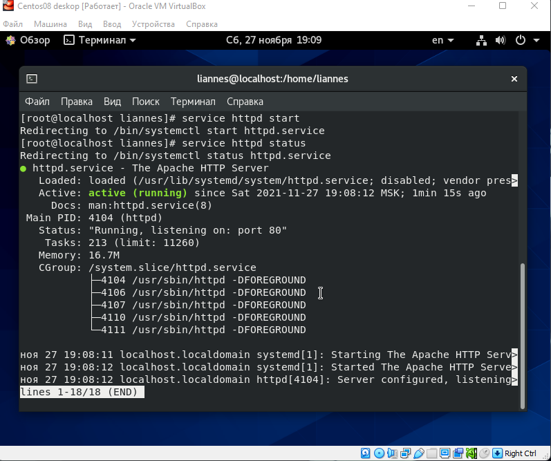
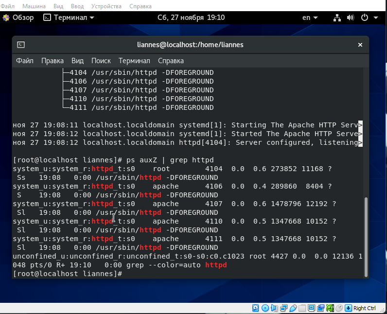
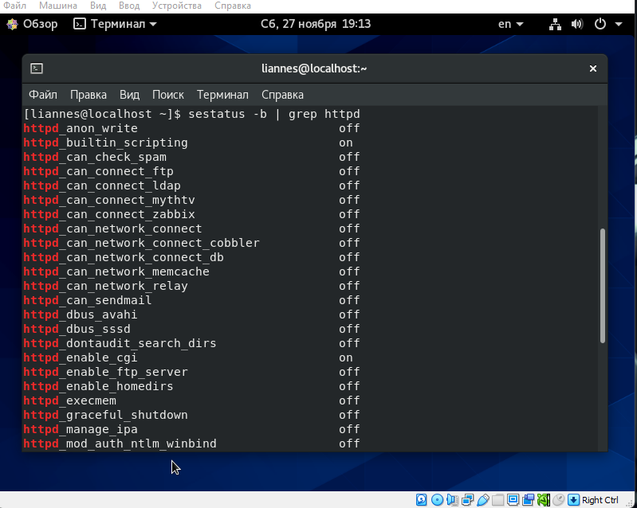
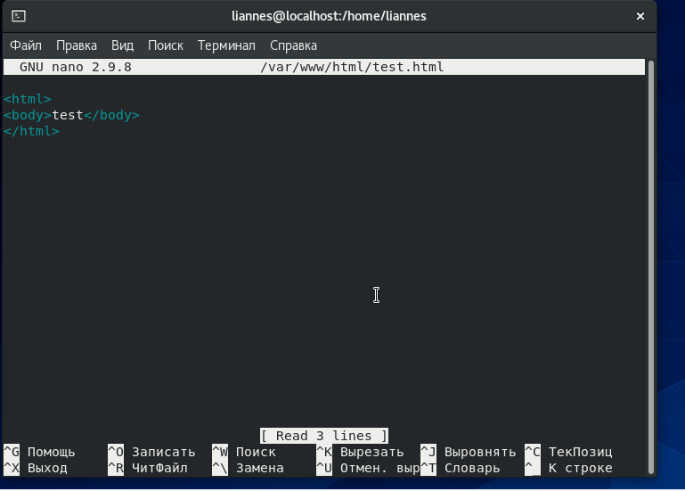
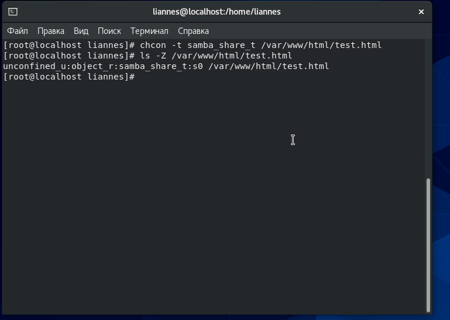
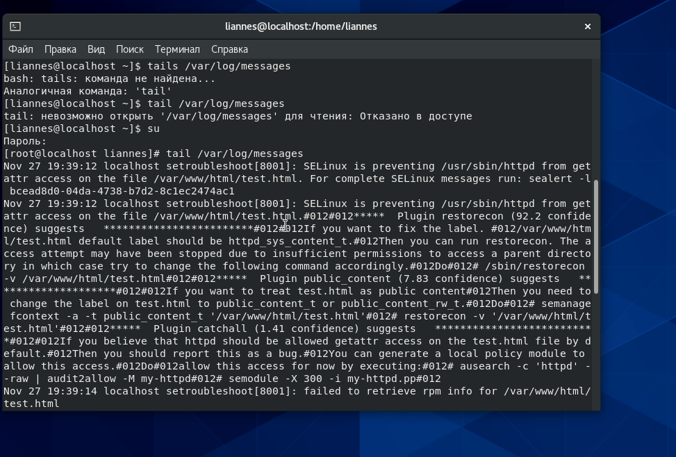
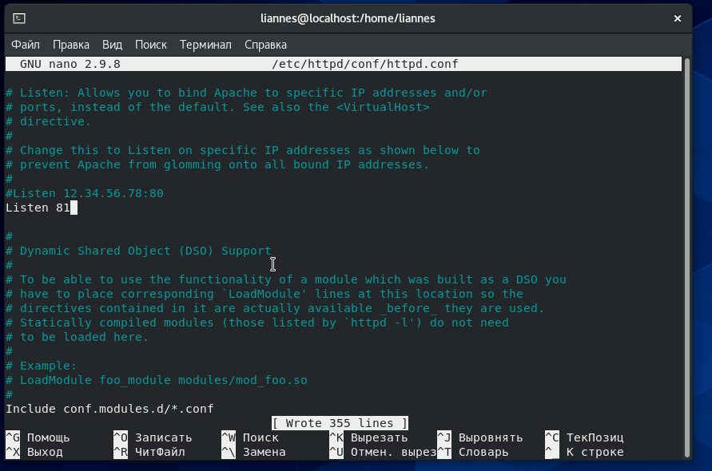

---
## Front matter
lang: ru-RU
title: Отчет по лабораторной работе №6
author: Панкратьев Александр Владимирович
institute: RUDN University, Moscow, Russian Federation
date: 2021

## Formatting
mainfont: Times New Roman
romanfont: Times New Roman
sansfont: Times New Roman
monofont: Times New Roman
toc: false
slide_level: 2
theme: metropolis
header-includes:
 - \metroset{progressbar=frametitle,sectionpage=progressbar,numbering=fraction}
 - '\makeatletter'
 - '\beamer@ignorenonframefalse'
 - '\makeatother'
aspectratio: 43
section-titles: true
---

## Цель работы

Развить навыки администрирования ОС Linux. Получить первое практическое знакомство с технологией SELinux
Проверить работу SELinx на практике совместно с веб-сервером Apache.

## Выполнение лабораторной работы

Для выполнения работы, установил httpd (рис. -@fig:001).

{#fig:001 width=70%}

## Выполнение лабораторной работы

Следующим действием посмотреть httpd.conf (рис. -@fig:002).

{#fig:002 width=70%}

## Выполнение лабораторной работы

Дальше от именни root добавил значения ServerName в httpd.conf  (рис. -@fig:003, -@fig:004).

{#fig:003 width=70%}

{#fig:004 width=70%}

## Выполнение лабораторной работы

Вернул разрешения обратно (рис. -@fig:005)

{#fig:005 width=70%}

## Выполнение лабораторной работы

Отключил фильтры iptables (рис. -@fig:006).

{#fig:006 width=70%}

## Выполнение лабораторной работы

Дальше запустил сервис httpd (рис. -@fig:007)

{#fig:007 width=70%}

## Выполнение лабораторной работы

Следующим этапом нахожу список процессов от httpd (рис. -@fig:008).

{#fig:008 width=70%}

## Выполнение лабораторной работы

Использовал команду sestatus для того, чтобы посмотреть состояние переключателей для Apache (рис. -@fig:009).

{#fig:009 width=70%}

## Выполнение лабораторной работы

Дальше посмотреть статистику политики (рис. -@fig:010).

{#fig:010 width=70%}

## Выполнение лабораторной работы

Следом определил файлы в директории /var/www и /var/www/html (рис. -@fig:011)

{#fig:011 width=70%}

## Выполнение лабораторной работы

Создал файл test.html в директории /var/www/html/ с содержимом (рис. -@fig:012)

{#fig:012 width=70%}

## Выполнение лабораторной работы

Открыл браузер и перешел по пути http://127.0.0.1/test.html и увидел там текст (рис. -@fig:013)

{#fig:013 width=70%}
## Выполнение лабораторной работы

Проверил контекст test.html (рис. -@fig:014)
Присутсвует unconfined_u, потому что был создан мной;  
Роль object_r используется по умолчанию

{#fig:014 width=70%}

## Выполнение лабораторной работы

Изменил контекст файла test.html на samba_share_t (рис. -@fig:015)

{#fig:015 width=70%}

## Выполнение лабораторной работы

Обновил страницу браузера и увидел ошибку (рис. -@fig:016)

{#fig:016 width=70%}

## Выполнение лабораторной работы

Просмотрел файл log/messages (рис. -@fig:017)

{#fig:017 width=70%}

## Выполнение лабораторной работы

Изменил tcp порт на 81  (рис. -@fig:018)

{#fig:018 width=70%}

## Выполнение лабораторной работы

Запустил httpd и все получилось удачно, тк как 81 входит в политеку SeLinux (рис. -@fig:019)

[Перезапуск httpd](../image/19.png){#fig:019 width=70%}

## Выполнение лабораторной работы

Посмотрел логи файлов access_log и error_log, и не нашел ничего не крименального (рис. -@fig:020, -@fig:021)

[Содержимое access_log](../image/20.png){#fig:020 width=70%}

[Содержимое error_log](../image/21.png){#fig:021 width=70%}

## Выполнение лабораторной работы

Добавил в политику порт 81 и проверил на корректность (рис. -@fig:022)

[Проверка портов](../image/22.png){#fig:022 width=70%}

## Выполнение лабораторной работы

Перезапустил httpd и все прошло успешно (рис. -@fig:023)

[Проверка портов](../image/23.png){#fig:023 width=70%}

## Выполнение лабораторной работы

Поменял порт на 82 и получил ошибку, потому что он не в ходит в политеку SeLinux (рис. -@fig:024)

[Ошибка запуска](../image/24.png){#fig:024 width=70%}

## Выводы

В результате выполнения познакомился с SeLinux и развил навыки владения OC Linux