---
# Front matter
lang: ru-RU
title: "Отчёт по лабораторной работе"
subtitle: "Лабораторная №6"
author: "Панкратьев Александр Владимирович"

# Formatting
toc-title: "Содержание"
toc: true # Table of contents
toc_depth: 2
lof: true # List of figures
lot: true # List of tables
fontsize: 12pt
linestretch: 1.5
papersize: a4paper
documentclass: scrreprt
polyglossia-lang: russian
polyglossia-otherlangs: english
mainfont: Times New Roman
romanfont: Times New Roman
sansfont: Times New Roman
monofont: Times New Roman
mainfontoptions: Ligatures=TeX
romanfontoptions: Ligatures=TeX
sansfontoptions: Ligatures=TeX,Scale=MatchLowercase
monofontoptions: Scale=MatchLowercase
indent: true
pdf-engine: lualatex
header-includes:
  - \linepenalty=10 # the penalty added to the badness of each line within a paragraph (no associated penalty node) Increasing the value makes tex try to have fewer lines in the paragraph.
  - \interlinepenalty=0 # value of the penalty (node) added after each line of a paragraph.
  - \hyphenpenalty=50 # the penalty for line breaking at an automatically inserted hyphen
  - \exhyphenpenalty=50 # the penalty for line breaking at an explicit hyphen
  - \binoppenalty=700 # the penalty for breaking a line at a binary operator
  - \relpenalty=500 # the penalty for breaking a line at a relation
  - \clubpenalty=150 # extra penalty for breaking after first line of a paragraph
  - \widowpenalty=150 # extra penalty for breaking before last line of a paragraph
  - \displaywidowpenalty=50 # extra penalty for breaking before last line before a display math
  - \brokenpenalty=100 # extra penalty for page breaking after a hyphenated line
  - \predisplaypenalty=10000 # penalty for breaking before a display
  - \postdisplaypenalty=0 # penalty for breaking after a display
  - \floatingpenalty = 20000 # penalty for splitting an insertion (can only be split footnote in standard LaTeX)
  - \raggedbottom # or \flushbottom
  - \usepackage{float} # keep figures where there are in the text
  - \floatplacement{figure}{H} # keep figures where there are in the text
---

# Цель работы

Развить навыки администрирования ОС Linux. Получить первое практическое знакомство с технологией SELinux
Проверить работу SELinx на практике совместно с веб-сервером Apache.

# Выполнение лабораторной работы

Для выполнения работы, установил httpd (рис. -@fig:001).

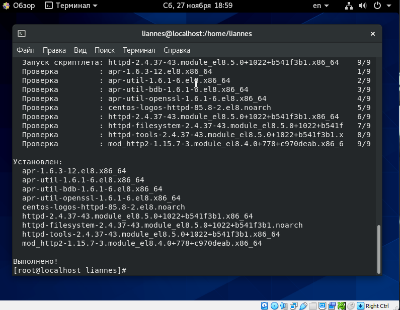{#fig:001 width=70%}

Следующим действием посмотреть httpd.conf (рис. -@fig:002).

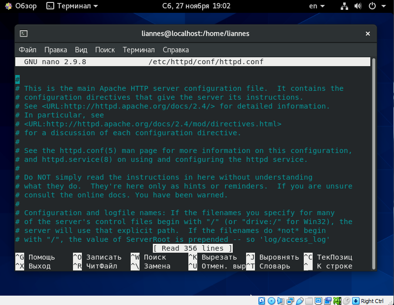{#fig:002 width=70%}

Дальше от именни root добавил значения ServerName в httpd.conf  (рис. -@fig:003, -@fig:004).

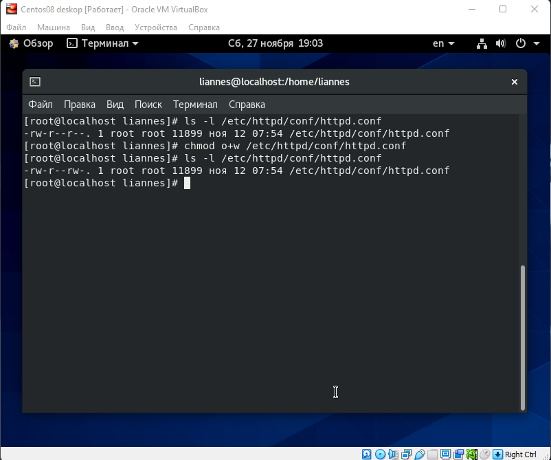{#fig:003 width=70%}

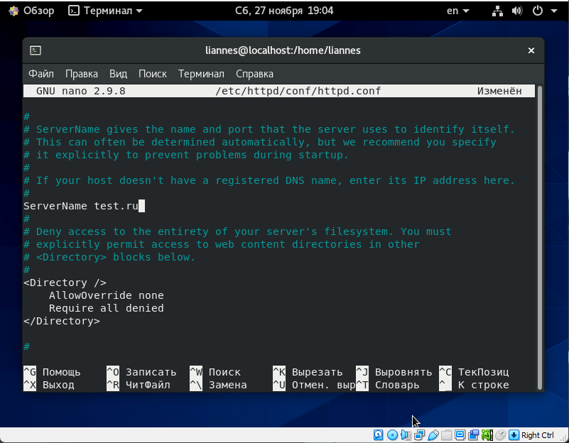{#fig:004 width=70%}

Вернул разрешения обратно (рис. -@fig:005)

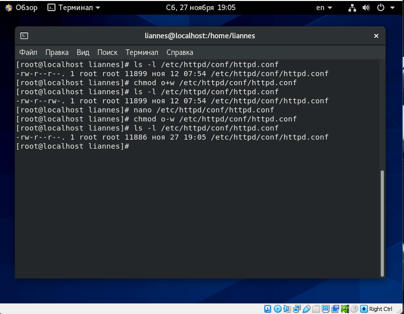{#fig:005 width=70%}

Отключил фильтры iptables (рис. -@fig:006).

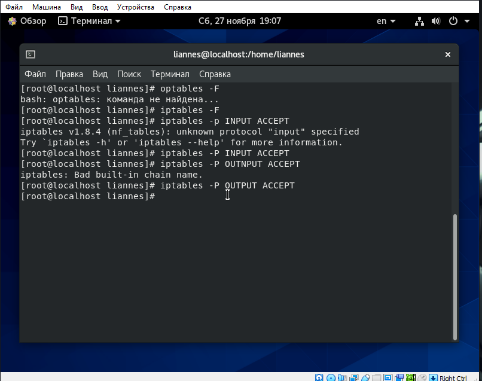{#fig:006 width=70%}

Дальше запустил сервис httpd (рис. -@fig:007)

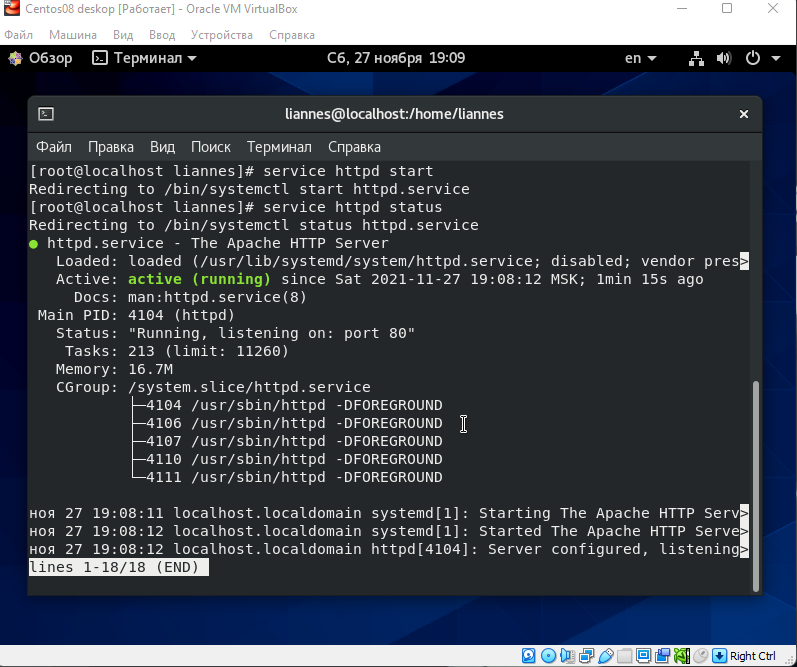{#fig:007 width=70%}

Следующим этапом нахожу список процессов от httpd (рис. -@fig:008).

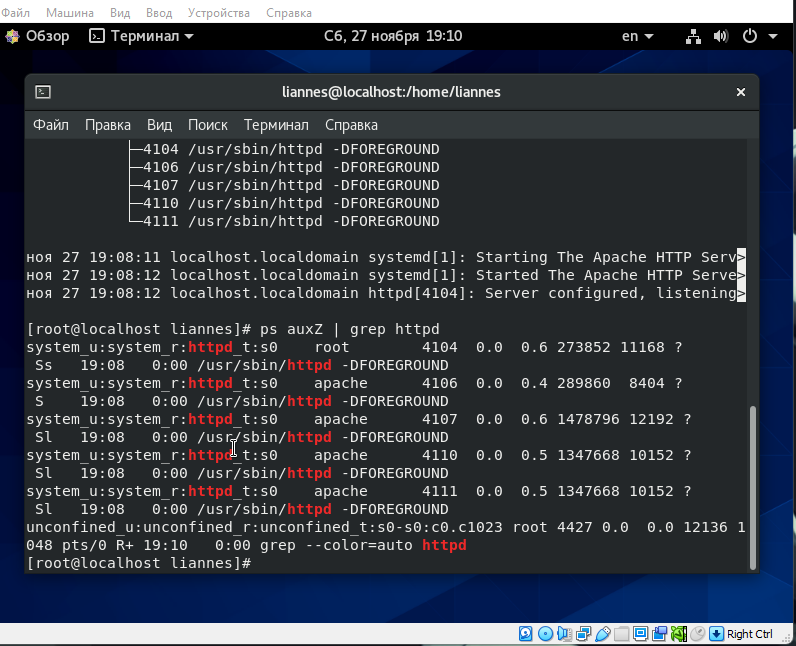{#fig:008 width=70%}

Использовал команду sestatus для того, чтобы посмотреть состояние переключателей для Apache (рис. -@fig:009).

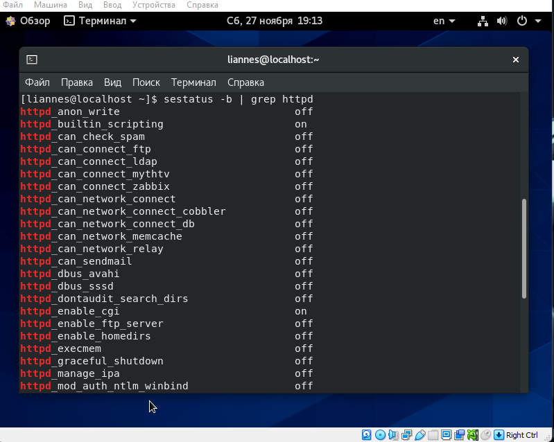{#fig:009 width=70%}

Дальше посмотреть статистику политики (рис. -@fig:010).

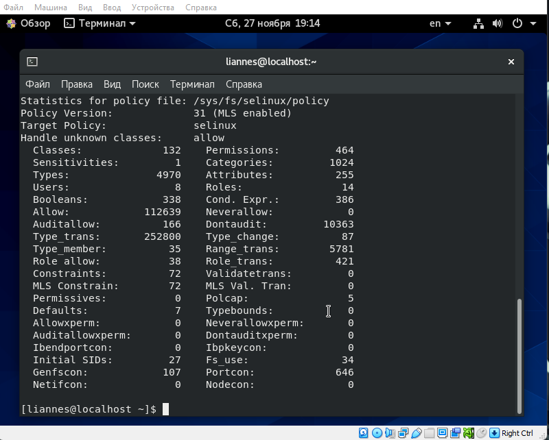{#fig:010 width=70%}

Следом определил файлы в директории /var/www и /var/www/html (рис. -@fig:011)

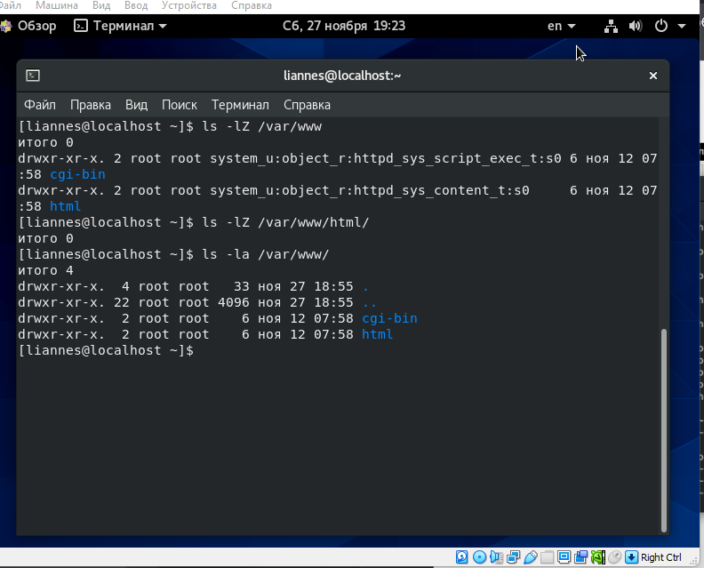{#fig:011 width=70%}

Создал файл test.html в директории /var/www/html/ с содержимом (рис. -@fig:012)

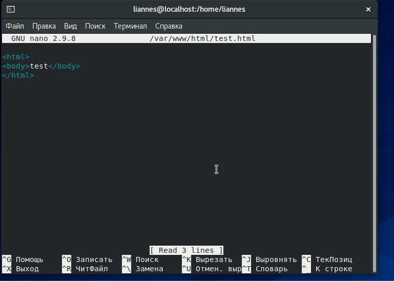{#fig:012 width=70%}

Открыл браузер и перешел по пути http://127.0.0.1/test.html и увидел там текст (рис. -@fig:013)

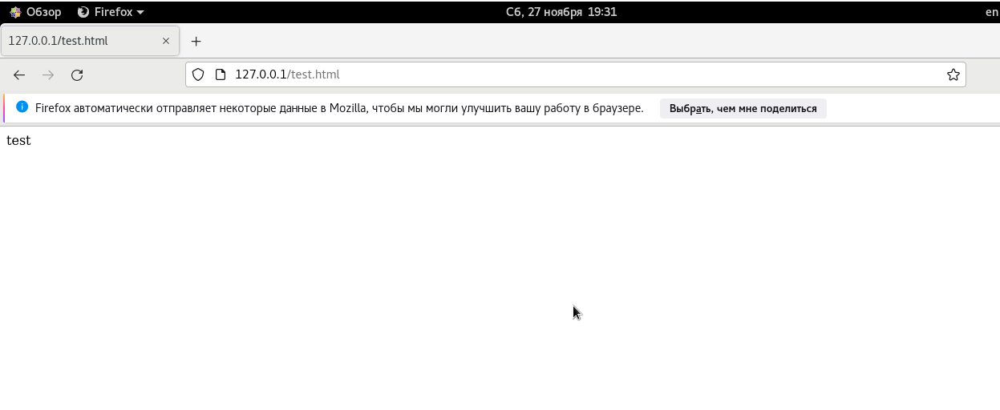{#fig:013 width=70%}

Проверил контекст test.html (рис. -@fig:014)

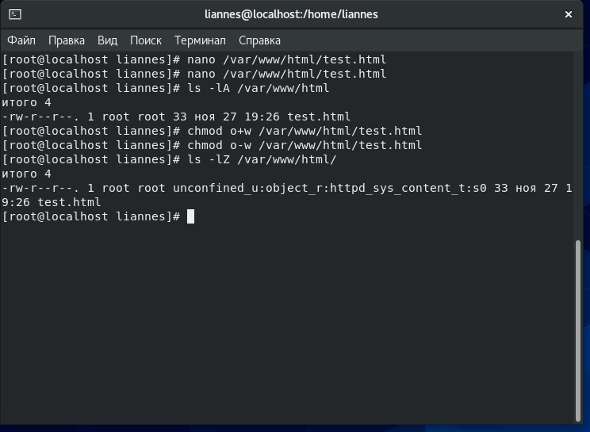{#fig:014 width=70%}

Присутсвует unconfined_u, потому что был создан мной;  
Роль object_r используется по умолчанию

Изменил контекст файла test.html на samba_share_t (рис. -@fig:015)

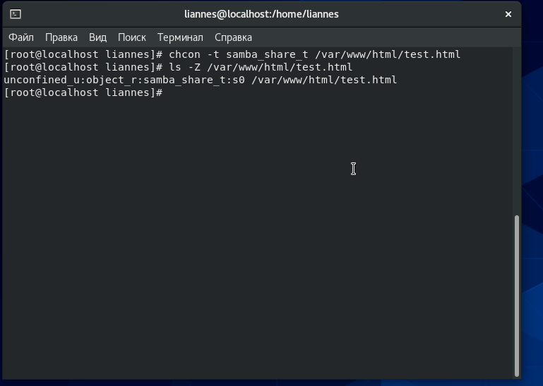{#fig:015 width=70%}

Обновил страницу браузера и увидел ошибку (рис. -@fig:016)

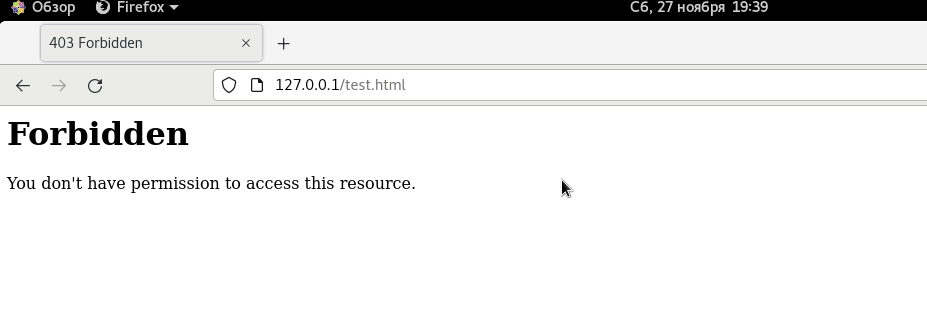{#fig:016 width=70%}

Просмотрел файл log/messages (рис. -@fig:017)

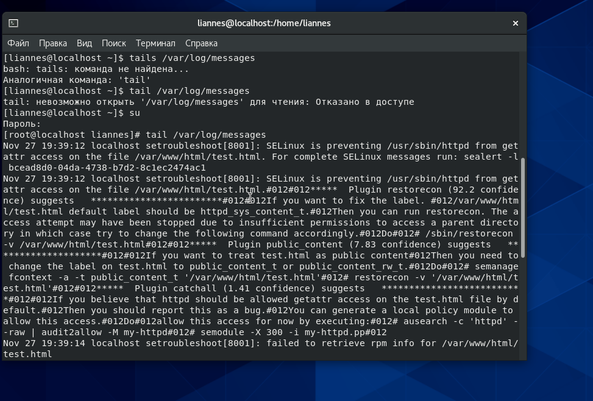{#fig:017 width=70%}

Изменил tcp порт на 81  (рис. -@fig:018)

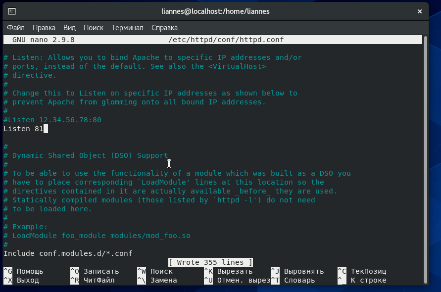{#fig:018 width=70%}

Запустил httpd и все получилось удачно, тк как 81 входит в политеку SeLinux (рис. -@fig:019)

[Перезапуск httpd](../image/19.png){#fig:019 width=70%}

Посмотрел логи файлов access_log и error_log, и не нашел ничего не крименального (рис. -@fig:020, -@fig:021)

[Содержимое access_log](../image/20.png){#fig:020 width=70%}

[Содержимое error_log](../image/21.png){#fig:021 width=70%}

Добавил в политику порт 81 и проверил на корректность (рис. -@fig:022)

[Проверка портов](../image/22.png){#fig:022 width=70%}

Перезапустил httpd и все прошло успешно (рис. -@fig:023)

[Проверка портов](../image/23.png){#fig:023 width=70%}

Поменял порт на 82 и получил ошибку, потому что он не в ходит в политеку SeLinux (рис. -@fig:024)

[Ошибка запуска](../image/24.png){#fig:024 width=70%}

# Вывод 

В результате выполнения познакомился с SeLinux и развил навыки владения OC Linux